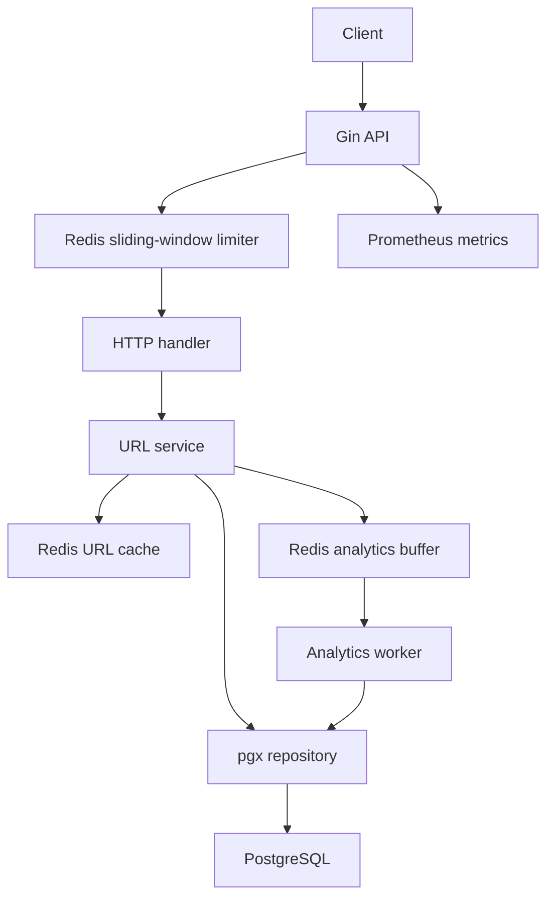

# URL Shortener

A Go/Gin backend with PostgreSQL persistence through pgx, Redis URL caching and distributed sliding-window rate limits, buffered click analytics, Prometheus metrics, migrations, Docker Compose, and integration/load tests. The imported Next.js SnapLink dashboard remains available in mock mode.

The downloaded project was imported systematically in separate commits. Its original README is preserved in [docs/imported-readme.md](docs/imported-readme.md), and the earlier source analysis is archived in [docs/import-analysis.md](docs/import-analysis.md). The backend blueprint was then implemented in separate feature commits without rewriting the import history.

## Start the backend

With Docker Desktop running, from the repository root:

```powershell
cd backend
Copy-Item .env.example .env
docker compose up -d --build
```

On an existing checkout, keep your configured `.env` rather than overwriting it. Compose starts PostgreSQL and Redis, applies migrations, then starts the API. Development services bind to loopback; data is stored in named volumes. `docker compose down` stops the stack and retains those volumes.

- API: [http://localhost:8080](http://localhost:8080)
- Swagger: [http://localhost:8080/swagger/index.html](http://localhost:8080/swagger/index.html)
- Liveness: `/healthz`; readiness checks PostgreSQL and Redis: `/readyz`
- Prometheus scrape endpoint: `/metrics`
- Host PostgreSQL: `localhost:15432`; Redis: `localhost:16379`

Enable the optional Prometheus service:

```powershell
docker compose --profile monitoring up -d prometheus
```

Open [http://localhost:9090](http://localhost:9090). Its `url-shortener` target scrapes the API every ten seconds. Example queries: `rate(redirects_total[1m])`, `rate(cache_hits_total[1m])`, and `rate(rate_limit_rejections_total[1m])`. A Grafana dashboard is not included.

## Core API

### Create

`POST /api/urls` accepts an absolute HTTP(S) URL, up to 8,192 bytes. No authentication is required. New public links do not expire by default; optionally send a future RFC3339 `expires_at`.

```powershell
$link = Invoke-RestMethod -Method Post -Uri http://localhost:8080/api/urls `
  -ContentType application/json -Body '{"url":"https://example.com/some/very/long/path"}'
$link
```

HTTP 201:

```json
{
  "short_code": "aB91xK7q",
  "short_url": "http://localhost:8080/aB91xK7q"
}
```

Codes use eight cryptographically random Base62 characters, an SQL unique constraint and bounded collision retries. The default admission limit is **10 requests/minute/IP**. Limits use a Redis sliding window with server time and an atomic Lua script; concurrent API replicas share the same counters. HTTP 429 includes `Retry-After`, `X-RateLimit-Limit` and `X-RateLimit-Remaining`. Redis limiter failures return 503.

### Redirect

`GET /:code` checks the Redis cache, reads PostgreSQL on a miss, caches the destination and required metadata, then returns HTTP 302. Missing links return 404; expired links return 410. Cache entries retain the database ID and expiry, and their TTL cannot outlive the link. Authorized edits and deletions invalidate cached URLs; generation checks prevent stale in-flight reads from repopulating the cache.

The default redirect limit is **100 requests/minute/IP** across all codes. The preserved legacy redirect at `/api/v1/:shortCode` has its own 100/minute scope. The server trusts forwarded client-IP headers only from explicitly configured proxies.

### Statistics

`GET /api/urls/:code/stats` reports public-link statistics; authenticated users' links are accessible only through the existing owned-link API. The default stats limit is 100/minute/IP.

```powershell
Invoke-RestMethod "http://localhost:8080/api/urls/$($link.short_code)/stats"
```

```json
{
  "short_code": "aB91xK7q",
  "clicks": 1872,
  "created_at": "2026-10-08T02:00:00Z",
  "last_accessed": "2026-10-08T02:10:00Z",
  "expires_at": null,
  "top_referrers": [{"source": "https://news.example/article", "clicks": 90}]
}
```

Statistics reflect persisted batches, normally within five seconds. Redirects update Redis counts and last-access timestamps immediately. A worker seals batches, persists counts/events with an SQL batch-ID ledger in one transaction, then acknowledges Redis. A failed SQL commit or lost acknowledgement is safe to retry without double counting. Shutdown attempts a final flush. Daily hot-URL rankings are stored in Redis sorted sets for two days; no public ranking endpoint is exposed.

Detailed visit samples contain IP, user agent, referrer, browser and device. Country lookup is left empty; no geolocation provider is configured. Samples are capped at 10,000 per pending batch while aggregate counts continue to grow. Consequently, top-referrer and legacy visit breakdowns can describe a sample at high traffic levels.

## Architecture and data



```text
backend/
├── cmd/server/              API and background worker
├── cmd/migrate/             Embedded, pgx-based migration CLI
├── cmd/loadtest/            HTTP load client (does not follow redirects)
├── internal/
│   ├── config/              Environment validation and HTTP configuration
│   ├── handler/             HTTP transport and Swagger annotations
│   ├── service/             Policies, cache orchestration, transactions
│   ├── repository/          PostgreSQL queries; no Redis in URL repository
│   ├── cache/               Redis URL and analytics adapters
│   ├── middleware/          Rate limits, auth, CORS
│   ├── model/               Domain types and DTOs
│   ├── metrics/             Prometheus collectors
│   ├── routes/              Core and compatibility API routes
│   ├── database/            pgx pool and Redis connections
│   └── utils/
├── migrations/              Embedded up/down SQL and migration runner
├── monitoring/              Optional Prometheus configuration
├── scripts/benchmark.ps1
├── benchmarks/              Recorded cache comparison and raw JSON
├── docs/                    Generated Swagger and architecture notes
├── docker-compose.yml
└── Dockerfile
```

`urls` stores `id`, nullable `user_id`, unique `short_code VARCHAR(16)`, `original_url`, `click_count`, `created_at`, `expires_at` and `last_accessed`. `click_events` retains sampled visit details. `analytics_batches` records applied batches for retry safety. No ORM is used.

Migrations 006 and 007 upgrade the imported schema while preserving URL records and existing click totals. Legacy timestamp values are interpreted as UTC. Existing codes longer than 16 characters must be handled before upgrading; the migration fails transactionally rather than truncating data. Integration tests verify a populated legacy schema upgrade and reversal of the new migrations. Rollbacks of schema changes remove the new analytics ledger/last-access fields, so review down migrations before running them on valuable data.

## Configuration and local Go development

Use Go 1.26.2 or newer. `cmd/server` reads `.env` by default, or the file selected by `ENV_FILE`; process environment variables take precedence. Private `.env.test` is ignored and is never loaded automatically. Redis authentication/database selection belongs in `REDIS_URL`.

| Variable | Default / purpose |
| --- | --- |
| `DB_SERVER_URL` | Required PostgreSQL DSN for local Go commands |
| `REDIS_URL` | Redis URL; example uses host port 16379 |
| `JWT_SECRET` | Required, at least 32 bytes; example is for local development |
| `BASE_URL` | `http://localhost:8080`; HTTP(S) origin for short links |
| `PORT` | `8080` for local Go server |
| `CACHE_ENABLED`, `CACHE_TTL` | `true`, `1h` |
| `ANALYTICS_FLUSH_INTERVAL` | `5s` |
| `CREATE_RATE_LIMIT` | `10` per minute/IP |
| `REDIRECT_RATE_LIMIT`, `STATS_RATE_LIMIT` | `100` per minute/IP |
| `TRUSTED_PROXIES` | Empty by default; comma-separated IPs/CIDRs |
| `CORS_ORIGINS` | `http://localhost:3000` |
| `DB_MAX_CONNECTIONS`, `DB_MIN_CONNECTIONS` | Pool defaults 20 and 5 |
| `DB_MAX_IDLETIME_CONNECTION_TIME` | Idle timeout in minutes |
| `DB_MAX_LIFETIME_CONNECTION_TIME` | Lifetime in hours |

Compose uses its own internal database/Redis addresses. `API_PORT`, `POSTGRES_PORT` and `REDIS_PORT` override published host ports; set `BASE_URL` accordingly if changing `API_PORT`. Set `POSTGRES_PASSWORD` consistently before initializing the PostgreSQL volume. Changing an environment password does not change an already initialized database user's password.

For a host Go server, stop the Compose API first to free port 8080:

```powershell
docker compose stop api
go run ./cmd/migrate -direction up
go run ./cmd/server
```

The migration CLI embeds SQL files, takes a PostgreSQL advisory lock and applies each migration atomically. `-direction down -steps 1` rolls back one migration; omitting `-steps` applies all remaining migrations in the selected direction.

## Metrics and validation

`/metrics` exports `http_requests_total`, `redirects_total`, `cache_hits_total`, `cache_misses_total`, `rate_limit_rejections_total`, `request_duration_seconds`, Go/process metrics and cache/rate/analytics error, sample-drop, pending-batch and flush counters. Request labels use bounded route templates, methods and statuses rather than individual codes, URLs or IPs.

```powershell
go build ./...
go test -count=1 ./...
go vet ./...
go mod verify
go mod tidy -diff
gofmt -l .
docker compose run --rm --build test
```

The container test target installs a C compiler for `go test -race -tags integration -count=1 ./...`. PostgreSQL integration tests use a temporary schema. Redis database 13 must be **empty and dedicated to this suite**; the tests clean it afterward. CI runs the same integration/race checks against isolated service containers. To run integration tests on the host, set `INTEGRATION_DATABASE_URL` and `INTEGRATION_REDIS_URL` explicitly; see `.env.test.example` for local values.

Verified on 8 October 2026: backend build/vet/module checks, unit tests, real PostgreSQL/Redis migration/API tests, container race tests, Docker runtime/health checks and a live Prometheus scrape. Tests cover collisions, cached metadata/expiry, stale-fill rejection, rate-limit concurrency/window boundaries, analytics retry safety including a lost Redis ACK after a real PostgreSQL commit, private stats, mutation invalidation and metrics cardinality.

Run the cache comparison from `backend`:

```powershell
./scripts/benchmark.ps1 -Requests 10000 -Concurrency 100
```

The recorded run completed all requests with HTTP 302: **7,118 requests/sec without URL caching, 6,089 with caching**. This local comparison showed no speedup. Details, caveats and raw results are in [backend/benchmarks/README.md](backend/benchmarks/README.md); these figures are not a production capacity claim.

## Preserved API and frontend

The authenticated API remains under `/api/v1`: registration/login/refresh, logout/current user/sessions, owned URL creation/list/update/delete, role-gated analytics, and administrator user/URL listing. Its JSON contracts remain in their original shape. Custom aliases require premium/admin; free/base accounts retain their URL quotas. Legacy authenticated creation still uses a 24-hour expiry and ignores its request expiry field; the new public API supports optional expiry correctly. Generated Swagger describes both API trees. The old account-deletion controller is not registered as a route.

Preview the imported frontend:

```powershell
cd frontend
pnpm install --frozen-lockfile
Copy-Item .env.example .env.local
pnpm dev
```

Open [http://localhost:3000](http://localhost:3000). Its existing mock mode supports a UI preview. Live integration still needs an adapter: the UI calls `/links`, expects camelCase link arrays and combined analytics, while the preserved authenticated backend uses `/api/v1/urls`, paginated snake_case data and separate analytics endpoints. Fetching `/auth/me`, cookie credentials, authentication guards and working settings/edit/QR actions remain frontend work.

## Operational limits

The core blueprint is implemented; the inherited authentication flows have not undergone a full security redesign. Refresh-token rotation still needs atomic validation under concurrent reuse, and session revocation does not immediately invalidate already issued access JWTs. These inherited gaps are separate from the tested anonymous core API.

Redis is required for distributed admission and buffered analytics. AOF every-second persistence can lose recent buffered clicks after Redis storage loss; idempotent SQL commits prevent duplicate retries but do not make Redis data indestructible. Prolonged database outages retain batches and can grow Redis memory; monitor pending batches and flush errors. Cache invalidation failures are logged and counted, and stale entries can remain until TTL. The batch ledger and sampled event tables currently require an operator-defined retention policy. Development credentials, HTTP cookies and loopback bindings in Compose are local defaults; configure secrets, HTTPS, proxy trust and access boundaries for deployment.
